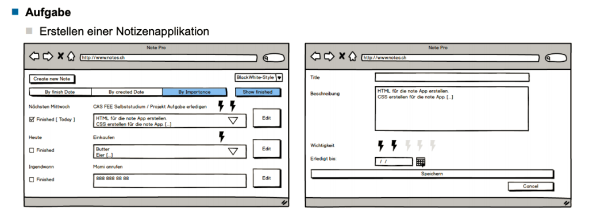

# Project 1 
## Beschreibung die Aufgabe ([detail beschreibung pdf])
#### Ziel: Grundlagen festigen von CSS/JS/HTML

### Einschränkungen
* Nutzung eines SPA Frameworks (Angular oder React +...) ist nicht erlaubt
  * Nutzung des MVC Patterns trotzdem sinnvoll
* Nutzung von Layout / Styling Framework wie Bootstrap nicht erlaubt
  * Flexbox und Grid nutzen
* Nutzung von simpler Templating Engine (z.B. Handlebars ) ist verlangt.

### Funktionsumfang
* Der Funktionsumfang ist in den Wire Frames dargestellt. Diese beinhalten u.a.
  * Anzeigen, editieren und erfassen von Notizen
  * Sortieren von Notizen
  * Filtern von „abgeschlossenen" Notizen
  * Abspeichern der Daten auf dem Server
  * Wechseln des Styles
## Lösung
* Genutzte templateing Engine "EJS"
* Abspeichern der Daten auf dem "Localstorage"

### Installation
* "npm install"
* "npm start"

